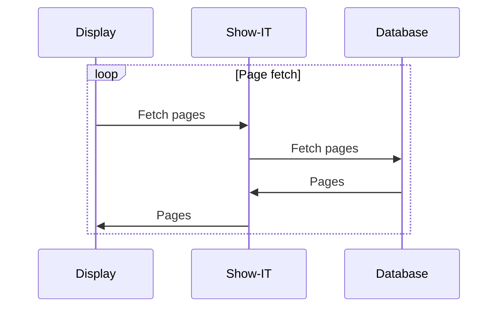
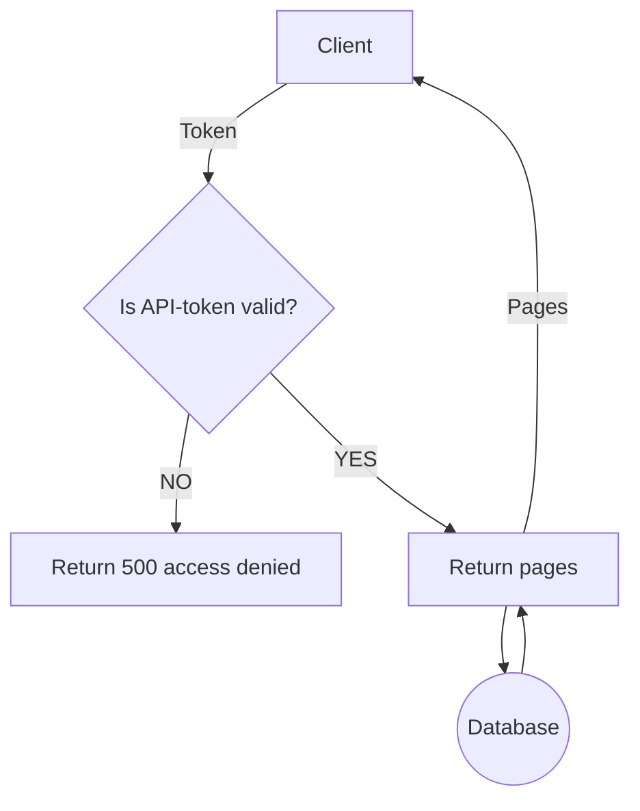
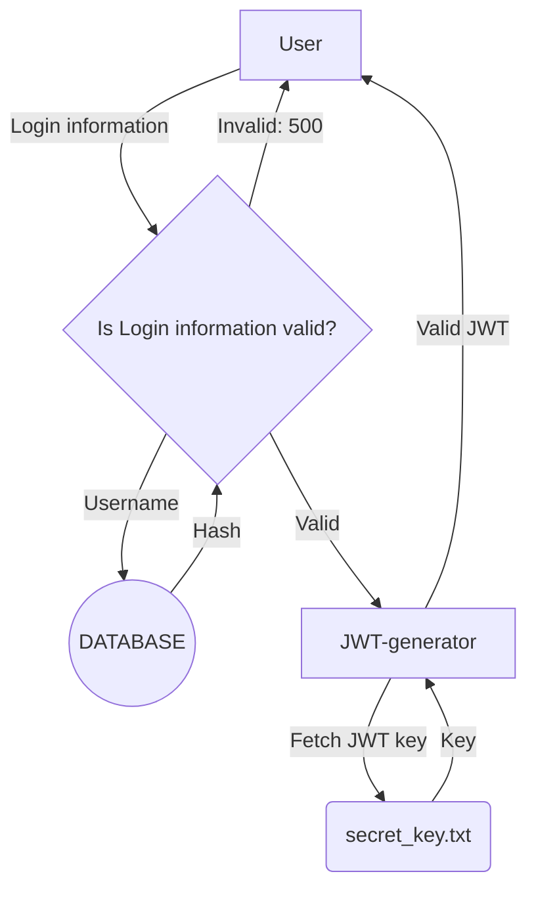

# Access control

### This document aims to explore access control for the following sub-services:
- The information display endpoint
- The information display management page
- The information display editor
---
### The information display endpoint
This is the endpoint used by devices to render relevant data. 
It functions like this:

To secure this traffic a API-token system must be implemented, All displays will be given an API-token that must be used to access a presentation. 
Like this:

### The information display management page
This page is used to create new displays. Here you can generate new API keys and configure displays.
The authentication on this endpoint will function like this:

