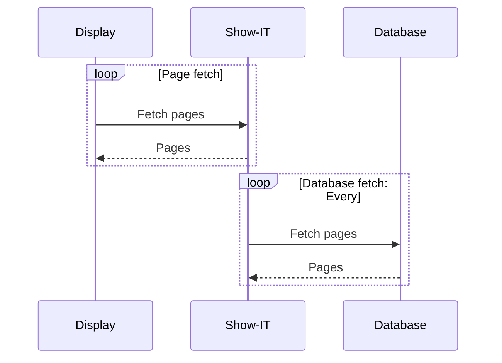
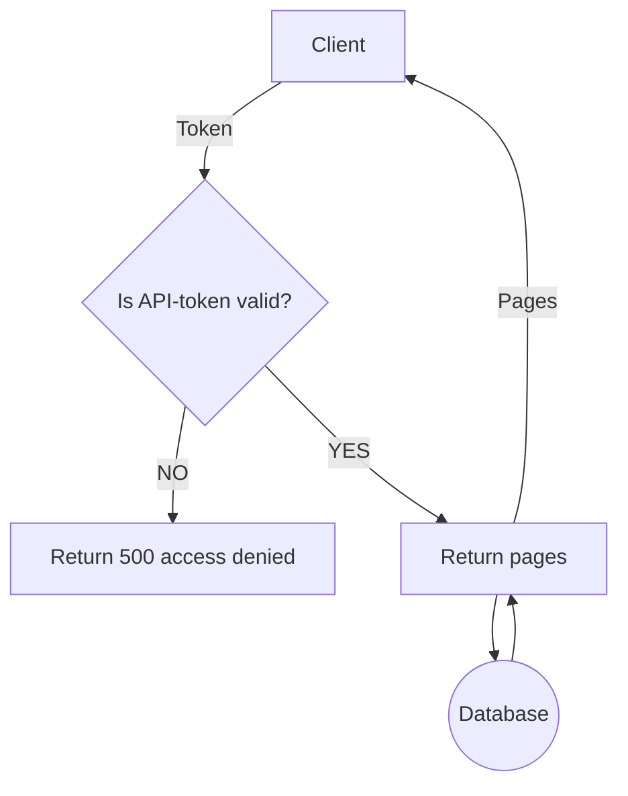
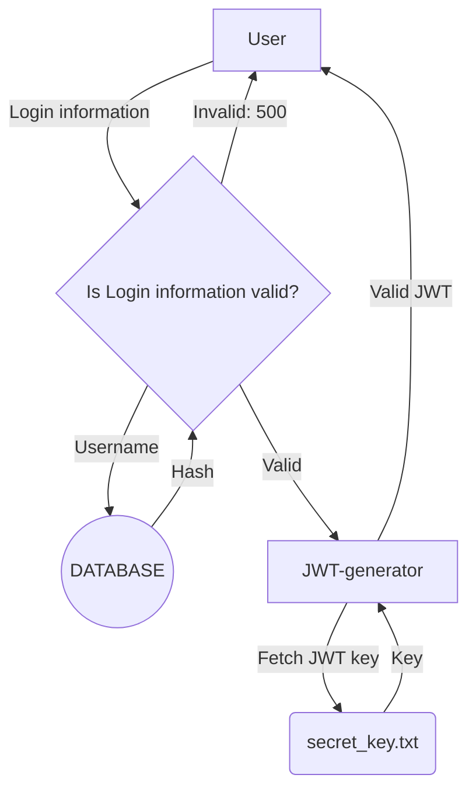
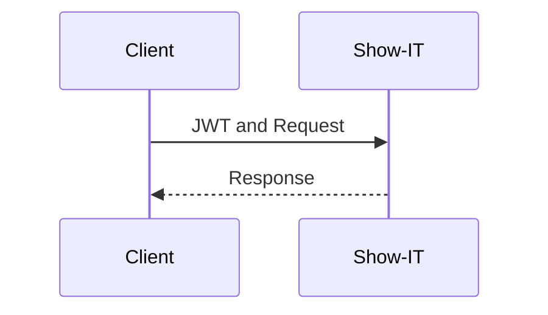
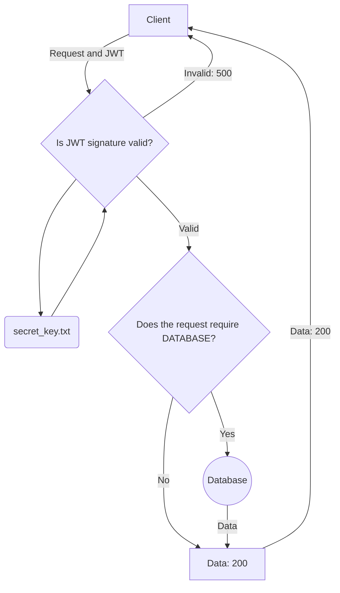

# Access control

### This document aims to explore access control for the following sub-services:
- Design philosophy
- The information display endpoint
- User authentication
---
## Glossary
### JSON Web Token
A JSON Web Token also known as a JWT is a base64 encoded string that contains some arbitrary JSON data and a signature. If the server is able to reproduce the signature from the data then the data has not been tampered with.
### Application Programming Interface
Application Programming Interface also known as an API refers to all endpoints used internally by the client to communicate with the server.
### Flow chart
A Flow chart is a diagram that visualizes a logical process.

##  Design philosophy:
Our goal with the authentication architecture is to find a design that consumes as few resources per request as possible therefor we are using we are using JSON Web Tokens and caching.
This allows us to run multiple parallel instances of the service without overloading the database,
this is favorable since it helps avoiding database related race conditions and other challenges that comes with having multiples of the same database.

## The information display endpoint
This is the endpoint used by devices to render relevant data. 
It functions like this:

> Note: The Show-IT server periodically fetches data and caches it to reduce strain on the database.

To secure this traffic a API-token system must be implemented, All displays will be given an API-token that must be used to access a presentation. 
Like this:

## User authentication
Authentication on all user endpoints will function like this:
#### Login

#### Request verification

> A typical request.
#### Request verification flow chart

> Note: we only fetch data from the database if necessary
> This allows the application to scale more easily. 

